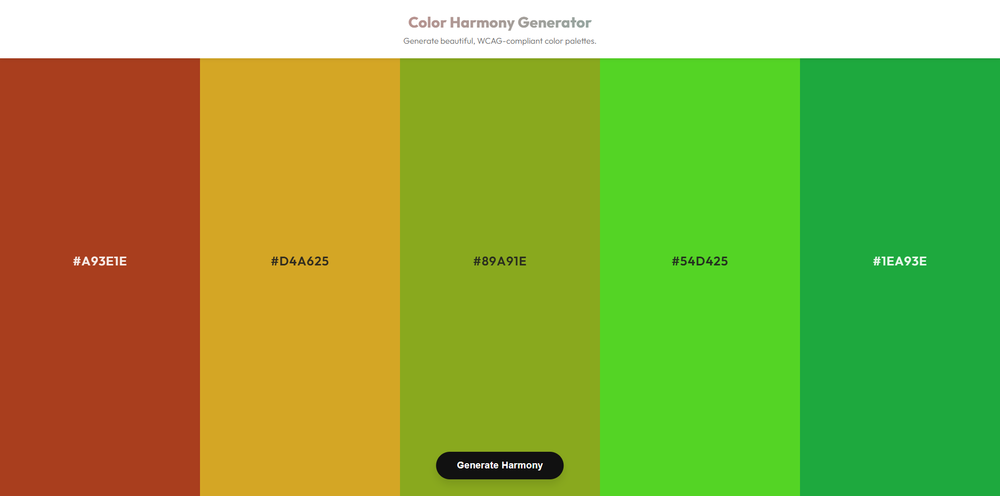

# Harmonious Hex Generator

A beautiful, responsive web application that generates harmonious, WCAG-compliant color palettes.

## 🚀 Features

- **Random Palette Generation**: Generates a 5-color palette using specific color harmony algorithms (Analogous + Complementary mix).
- **Smart Contrast**: Automatically adjusts text color (black/white) based on background luminance to ensure WCAG compliance.
- **Copy to Clipboard**: Easily copy hex codes with a click.
- **Keyboard Shortcut**: Press `Spacebar` to instantly generate a new palette.
- **Responsive Design**: Works seamlessly on desktop and mobile devices.

## 🛠️ Technologies Used

- **HTML5**: semantic structure.
- **CSS3**: Layouts (Flexbox), CSS Variables, and responsive media queries.
- **JavaScript (ES6+)**: logic for color generation, contrast calculation, and event handling.
- **Google Fonts**: Uses 'Outfit' for modern typography.

## 🏃‍♂️ How to Run

1. Clone or download this repository.
2. Open `index.html` in your web browser.
3. Click "Generate Harmony" or press the `Spacebar` to create new palettes.

## 🧩 Code Structure

- `index.html`: Main structure containing the color boxes and controls.
- `style.css`: Visual styling, animations, and responsive rules.
- `index.js`:
  - `setRandomColors()`: Core logic for generating HSL values and converting to Hex.
  - `getContrastColor()`: Calculates YIQ contrast to determine text readability.
  - `hslToHex()`: Utility to convert HSL color values to Hex strings.

## 📄 License

This project is open source and available for personal or educational use.
